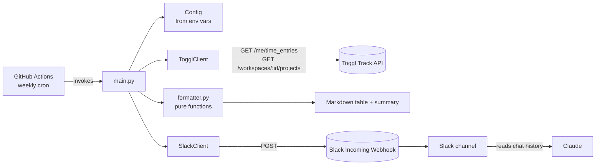

# Toggl Track to Slack Digest

A small, stateless Python job that fetches your Toggl Track time entries for
the last N days, formats them into a Markdown table (with project and tags
per entry) plus a summary -- total hours, hours per project and per tag
(each with % of total and average hours/day), and hours per day -- and
posts the result to a Slack channel via an Incoming Webhook. It's built to
run on a weekly GitHub Actions cron so a digest shows up automatically, and
the format is deliberately rigid (fixed columns, fixed rounding, no merged
cells) so that an LLM reading the Slack channel -- such as Claude -- can
parse it reliably and compare patterns week over week.

## Architecture



## Prerequisites

- **Toggl Track API token**: log in at https://track.toggl.com/profile and
  copy the API token near the bottom of the page.
- **Toggl workspace id**: visible in the URL when viewing your workspace on
  track.toggl.com (e.g. `https://track.toggl.com/<workspace_id>/...`), or via
  the Toggl API.
- **Slack Incoming Webhook**: create one at https://api.slack.com/apps ->
  "Create New App" -> "From scratch" -> under "Incoming Webhooks", toggle it
  on and "Add New Webhook to Workspace", picking the channel to post to. Copy
  the generated `https://hooks.slack.com/services/...` URL.

## Setup

1. Clone this repository.
2. Add the two required secrets under **Settings -> Secrets and variables ->
   Actions -> Secrets**:
   - `TOGGL_API_TOKEN`
   - `SLACK_WEBHOOK_URL`
3. Add non-secret configuration under **Settings -> Secrets and variables ->
   Actions -> Variables**:
   - `TOGGL_WORKSPACE_ID` (required)
   - `DIGEST_PERIOD_DAYS`, `TOGGL_PROJECT_IDS`, `TIMEZONE` (all optional --
     see the configuration reference below for defaults)
4. Do a first manual run from the **Actions** tab: open the "Weekly Toggl
   Digest" workflow and click **Run workflow** (this uses the
   `workflow_dispatch` trigger). Check the run logs and your Slack channel.

See the end of this README for the exact click-by-click steps.

## Configuration reference

| Variable | Required | Default | Description |
| --- | --- | --- | --- |
| `TOGGL_API_TOKEN` | Yes (secret) | none | Toggl Track API token, from track.toggl.com/profile |
| `TOGGL_WORKSPACE_ID` | Yes | none | Toggl workspace id to pull projects from |
| `SLACK_WEBHOOK_URL` | Yes (secret) | none | Slack Incoming Webhook URL to post the digest to |
| `DIGEST_PERIOD_DAYS` | No | `7` | Number of trailing days the digest covers |
| `TOGGL_PROJECT_IDS` | No | *(empty)* -- all projects | Comma-separated Toggl project ids to filter to |
| `TIMEZONE` | No | `UTC` | IANA timezone used for date range computation and display |

## Local development

```bash
# One-time setup
cp .env.example .env   # fill in your real values; .env is gitignored
python3 -m venv .venv
source .venv/bin/activate
make install-dev

# Load .env into your shell, then:
make test    # run the test suite
make lint    # mypy src/
make format  # black src/ tests/
make run     # fetch -> format -> post, using your .env values
make clean   # remove __pycache__ / .pytest_cache
```

`make run` reads configuration from the environment, so make sure your `.env`
is sourced first (e.g. `set -a; source .env; set +a` in bash/zsh) or export
the variables another way.

## Known limitations

- **Toggl rate limits**: 1 request/second across the API, and 30
  requests/hour specifically on `/me/*` endpoints (which includes the time
  entries fetch). `toggl_client.py` throttles requests and retries on HTTP
  429 with backoff, honoring `Retry-After` when present -- but don't schedule
  this job to run more than a few times per hour against the same token.
- **3-month lookback limit**: Toggl's `/me/time_entries` endpoint only
  returns entries within roughly the last 3 months. `DIGEST_PERIOD_DAYS`
  should stay well under that.
- **1000-entry cap per call**: `/me/time_entries` returns at most 1000
  entries and gives no error when it truncates. If a run hits that cap,
  the job fails with a clear error rather than posting an under-reported
  digest -- narrow `DIGEST_PERIOD_DAYS` or `TOGGL_PROJECT_IDS` and re-run.
- **Slack tables don't render visually**: Slack's `mrkdwn` formatting does
  not turn Markdown pipe tables into an actual visual table -- it displays
  the raw `| a | b |` text. This is intentional here: the digest is meant to
  be read programmatically (e.g. by Claude scanning the channel), not viewed
  as a pretty table by a human.

## How to extend

- **Reactions / threads / richer formatting**: an Incoming Webhook can only
  post plain messages -- it can't add reactions, reply in threads, or use
  interactive Block Kit elements tied to your bot identity. To do any of
  that, swap `slack_client.py` for a real Slack Bot Token (`xoxb-...`) and
  use `chat.postMessage` (and related endpoints) instead of the webhook URL.
  That requires adding OAuth scopes and installing the app to your
  workspace, which is more setup than a webhook -- only do this if you
  actually need those features.
- **Different schedule**: edit the `cron` expression in
  `.github/workflows/weekly_digest.yml` (fields are minute, hour,
  day-of-month, month, day-of-week; https://crontab.guru helps).
- **Different project scoping**: set `TOGGL_PROJECT_IDS` rather than editing
  code -- the filter is applied in `main.py` after fetching entries.

## First manual test run: exact steps

1. **Add secrets**: repo page -> **Settings** -> **Secrets and variables** ->
   **Actions** -> **Secrets** tab -> **New repository secret**.
   - Name: `TOGGL_API_TOKEN`, Value: (your Toggl API token) -> **Add secret**
   - Name: `SLACK_WEBHOOK_URL`, Value: (your Slack webhook URL) -> **Add secret**
2. **Add variables**: same page -> **Variables** tab -> **New repository
   variable**.
   - Name: `TOGGL_WORKSPACE_ID`, Value: (your workspace id) -> **Add variable**
   - Optionally add `DIGEST_PERIOD_DAYS`, `TOGGL_PROJECT_IDS`, `TIMEZONE` the
     same way.
3. **Run it**: repo page -> **Actions** tab -> select **Weekly Toggl Digest**
   in the left sidebar -> **Run workflow** button (top right) -> confirm
   branch -> **Run workflow**.
4. **Check the result**: click into the new run to watch the logs, and check
   your Slack channel for the posted digest.
